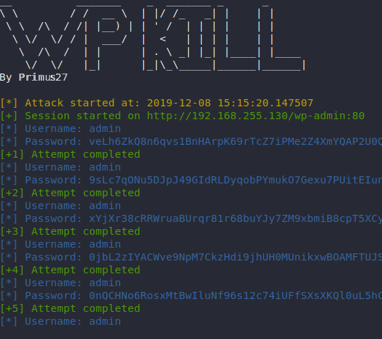

# WordPress Denial of Service (CVE-2014-9016)

## Disclaimer
The contents of this script are intended to only be used only in an ethical manner. 
Do not use this script if you do not have written permission from the owner of 
the equipment. If you perform illegal actions, you are likely to be arrested 
and prosecuted to the full extent of the law. Primus27 does not take any 
responsibility if you misuse any of the scripts - they are for proof of concept only. 
The application herein must only be used while testing environments with proper 
written authorizations from appropriate persons responsible.

## Exploit
 - Take WordPress services offline through automating a long password attack
 - This script attacks WordPress at the application layer by exploiting:
    - The lack of max password enforcements
    - The lack of additional security measures such as CAPTCHAs
    
## Solution
 - Update WordPress to >5.0.1

## Features
 - Automate the takedown of a WordPress site
 - Can run in headless or verbose mode
 - Optimised significantly from version 1 (not available on GitHub)

## Screenshots

> Application demo (Script start)

> Application demo (Script end)

## Requirements and Installation
 - Requires the WordPress version to be <5.0.1
 - [Python 3.6+](https://www.python.org/)
 - Linux (tested)
 - Install all dependencies from the requirements.txt file. `pip3 install -r requirements.txt`

## Arguments

#### Required arguments:
  - `T` || `--target`
    - Specify IP address or URL of the WordPress machine.
	- If an IP address is specified, the script constructs a URL (http://{IP_Address}/wp-admin)
	- If a URL is specified, the script does not construct a URL.

#### Optional arguments:
  - `--attempts`
    - Specify the number of attempts before the script ends.
    - Default: 500
    - **NOTE:** Script automatically ends after 5 failed attempts.

  - `--attempts`
    - Specify the number of attempts before the script ends.
    - Default: 500
    - **NOTE:** Script automatically ends after 5 failed attempts.
  
  
  - `--length`
    - Specify the base length of the password entry.
    - Default: 1000000
    
    
  - `-nF` || `--noFeedback`
    - This disables the output of the username & password entries instead, just showing whether the attempt completed / failed.
    - Default: Disabled
  
  
  - `-V` || `--verbose`
    - Flag for the program not to run in headless mode. This launches a browser and shows every action.
    - Default: Disabled
  
  
  - `--version`
    - Display program version

## Usage
 - Run 'wp_kill.py' in terminal with arguments (see above)

### Starter command(s)
 - Typical attack
    - `python3 wp_kill.py -T TARGET_IP`

## Changelog
#### Version 1.0 - Initial release
 - WordPress target is taken offline
 - CLI menu parameters
    
#### Version 2.0 - Performance and feature improvements
 - Added custom 'attempts' option
 - Added custom 'length' option
 - Added 'no feedback' option
 - Added 'verbose' option
 - Significantly improved speed at which passwords are generated using a seed
 - Significantly improved performance by using the same FireFox session
 
#### Version 2.1 - Custom Username & Address

 - Added custom username argument (see username argument)
 - Added custom address (see target argument)

## Features in development
 - Multiprocessing support

